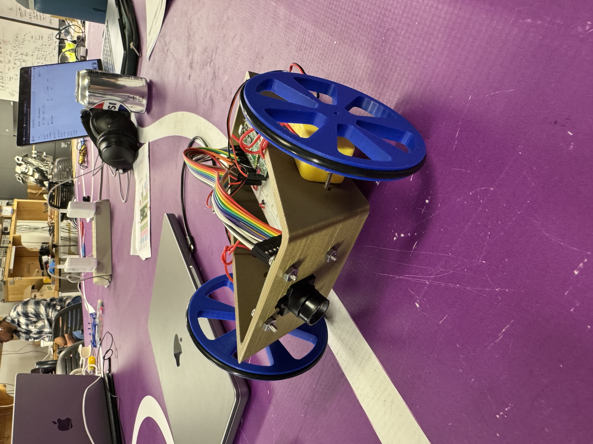
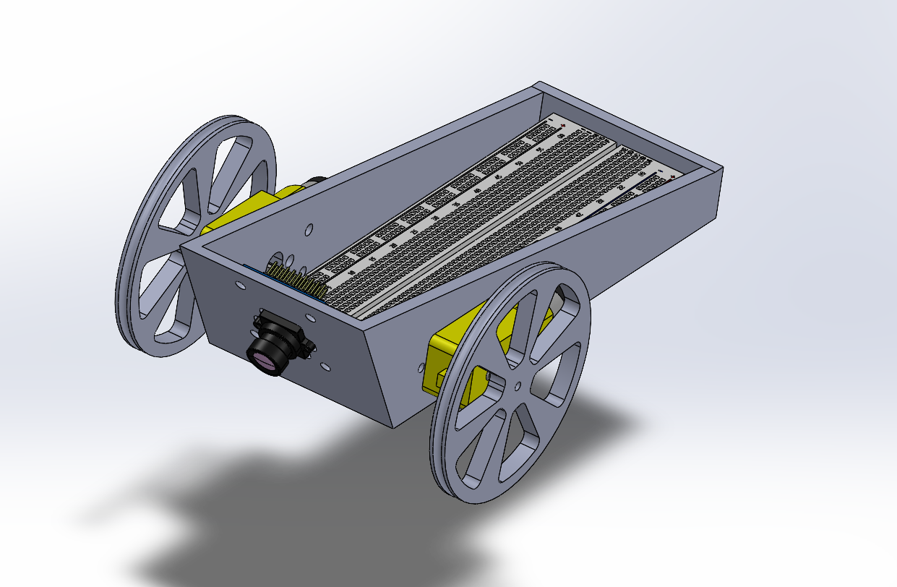

# 🚦 Project Highlights  

- **Autonomous line-following differential drive robot** built for the **2025 Tech Cup** in Northwestern’s Advanced Mechatronics course.  
- Designed and fabricated a lightweight chassis using a mix of **3D printing and laser-cut parts**; integrated supplied TT motors and battery pack for fair competition.  
- Implemented **sensor-based line detection** with a tuned **PID control algorithm** to achieve smooth, fast laps on a white-line-on-purple-background track.  
- Balanced **speed, stability, and reliability** through iterative prototyping, CAD modeling, and real-world testing.  

---

# Advanced Mechatronics – Line Following Robot (2025 Tech Cup)

This repository documents my **Advanced Mechatronics** project for building a **line-following differential drive robot** to compete in the 2025 Tech Cup. The assignment challenged students to design and fabricate a small autonomous robot capable of following a **white line on a purple background** for a 40-foot loop track.

---
## Robot CAD and Images
<table>
  <tr>
    <td align="center">
       
      <em>Robot Front View</em>
    </td>
    <td align="center">
       
      <em>Robot CAD Model</em>
    </td>
  </tr>
</table>

<table>
  <tr>
    <td align="center">
       
      <em>Robot Front View</em>
    </td>
    <td align="center">
       
      <em>Robot CAD Model</em>
    </td>
  </tr>
</table>

## 📖 Project Overview

The goal of this assignment was to design, build, and program a robot that:

- Uses the **provided drive motors** and **battery pack** to ensure a fair playing field.  
- **Follows a white line on a purple background** (approx. ¾″ wide) autonomously.  
- Achieves a **fast, stable lap** while maintaining control and reliability.  

Key constraints and motivations:

- **Fastest Lap Award**: Faster robots risk more control issues.  
- **Best Design Award**: Unique, well-crafted, or clever mechanisms are encouraged.  
- **Most Dangerous Award**: For particularly unconventional or bold designs.  
- **Fabrication Constraints**: The lab offers 3D printers, laser cutters, foam core, MDF, plywood, and standard hardware.  

---

## ⚙️ Hardware & Materials

### Supplied Components
- **Drive motors**: Yellow TT-style motors (~120 RPM at 4.5 V)  
- **Power supply**: 3×AA battery pack (≈ 4.5 V)  
- **Fasteners & O-rings**: Various 2-56 and 4-40 screws, nuts, locknuts, washers, and O-rings for wheels  

### Additional Materials
You could fabricate the chassis and mounts from:
- **Foam core** (fast and lightweight)  
- **MDF, plywood, or acrylic** (cut on the laser cutter)  
- **3D printed parts** (complex geometries, custom mounts)  
- **Hand-cut parts** (quick prototypes)  

### Design Considerations
- **Wheel diameter**: Larger wheels = higher top speed but slower acceleration and harder control.  
- **Casters**: Dragging elements (like spoons) can affect friction and stability.  
- **Fastener tension**: Screws should be kept in tension to prevent nuts from loosening.  

---

## 🛠️ Design & Fabrication

1. **CAD Modeling**  
   Used a CAD program to model the chassis, motor mounts, and sensor brackets. Iterated designs to balance weight, stiffness, and ease of assembly.  

2. **Rapid Prototyping**  
   - Combined **3D printed** motor mounts with **laser-cut** chassis plates for fast, precise fabrication.  
   - Embedded nuts and used threaded inserts where needed.  
   - Tested tolerances: 3D prints often come slightly oversized; holes undersized.  

3. **Assembly**  
   - Mounted the TT motors using 2-56 screws and locknuts.  
   - Installed O-rings on the wheels for traction.  
   - Wired the battery pack, motors, and sensors neatly for easy debugging.  

---

## 🧠 Electronics & Control

- **Microcontroller**: (Specify which you used—e.g., Raspberry Pi Pico, Arduino Nano, NU32, etc.)  
- **Line Sensors**: (Describe the sensors, e.g., IR reflectance sensors, their placement, and how many.)  
- **Motor Driver**: (Mention the driver board or H-bridge used to drive the TT motors.)  

### Control Algorithm
- **Line Detection**: Reads reflectance sensor values to detect the white line on purple background.  
- **PID Control**: Adjusts motor speeds proportionally to the error between the robot’s position and the center of the line.  
- **Differential Drive**: Left and right motors are independently controlled for smooth turning.
